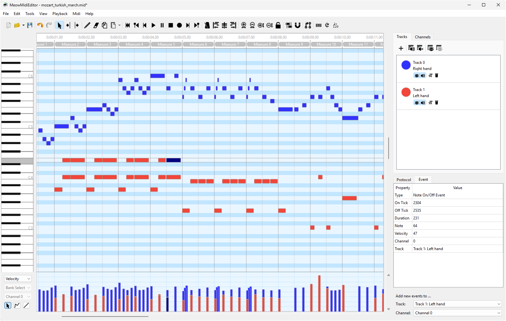

# MidiEditor

Downloads : [latest release](https://github.com/Meowchestra/MidiEditor/releases)

Updated MidiEditor with additional improvements, custom changes, & merged pull-requests ahead of upstream.

Based on [jingkaimori's fork](https://github.com/jingkaimori/midieditor/) of [ProMidEdit](https://github.com/PROPHESSOR/ProMidEdit), built on top of [MidiEditor](https://github.com/markusschwenk/midieditor).

### Introduction

MidiEditor is a free software providing an interface to edit, record, and play midi data.

The editor is able to open existing midi files and modify their content. New files can be created and the user can enter his own composition by either recording Midi data from a connected Midi device (e.g., a digital piano or a keyboard) or by manually creating new notes and other Midi events. The recorded data can be easily quantified and edited afterwards using MidiEditor.

### Features

* Easily edits, records and plays Midi files
* Can be connected to any Midi port (e.g., a digital piano or a synthesizer)
* Tracks, channels and Midi events can be edited
* Event quantization
* Control changes can be visualized
* Free
* Available for Windows

### Project Page and Manual

[https://meowchestra.github.io/MidiEditor/manual/](https://meowchestra.github.io/MidiEditor/manual/)
